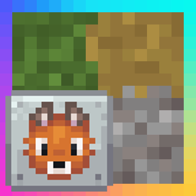

# NeoContinuity ([EN version](#english))

## 🍝赞助

NeoContinuity基本由我一人在PepperCode1所编写的Continuity基础之上完成.
来自广大玩家们的赞助将用于后续的更快的新旧版本移植与改善, 感谢所有支持者!
如果你喜欢这个MOD, 并且想要支持NeoContinuity的开发, 请前往[爱发电](https://afdian.com/a/argon4w)为狐狸买一份意面.
也十分感谢PepperCode1制作精良的Continuity, 若想支持Continuity的开发, 请前往[Buy Me a Coffee](https://buymeacoffee.com/peppercode1)进行赞助.

## 🖥️模组介绍

NeoContinuity是Continuity的非官方分支, 旨在于让Continuity能在NeoForge上 (无需信雅互联) 原生地运行, 并使用NeoForge API替换以减少部分冗余的FFAPI (Forgified-Fabric-API) 依赖. **请勿**向原作者报告任何游玩此模组遇到的问题.

## ✨为什么需要这个MOD

Continuity当前的NeoForge支持依赖于信雅互联 (Sinytra Connector) 与 FFAPI (Forgified-Fabric-API). 信雅互联引入游戏环境中后可能会引起很多兼容性问题或崩溃, 并且FFAPI会修改网络通信导致客户端无法加入到没有安装FFAPI的服务器中. 基于以上原因, 我决定制作原生支持NeoForge的Continuity分支, 即NeoContinuity.

## ⚙️工作原理

NeoContinuity不依赖于整个FFAPI (Forgified-Fabric-API)大包, 我将Continuity不需要的部分FFAPI子包进行了移除, 并对部分对FFAPI的依赖替换为原生的NeoForge API, 减少了不必要的JAR体积占用和改善可能造成的兼容性问题. 与此同时, 我手动修改了部分FFAPI子包以不再依赖正常环境中无法移除的会造成大量空间占用的forgified-fabric-loader.

# NeoContinuity

## 🍝Sponsorship

This MOD is almost done by myself based on the Continuity codebase written by PepperCode1.
Sponsorships from players can ensure the future ports to other versions. Thanks for everyone that support this MOD! If you like it and want to support my work on development of NeoContinuity, please consider sponsor me at [爱发电](https://afdian.com/a/argon4w).
Also thanks for PepperCode1 for making such great Continuity MOD. If you want to support the development of Continuity, Plase sponsor at [Buy Me a Coffee](https://buymeacoffee.com/peppercode1).

## 🖥️MOD Description

NeoContinuity is an unofficial fork of Continuity, aiming to run Continuity natively on NeoForge (without connector) and reduce some of the redundant FFAPI (Forgified-Fabric-API) dependencies using NeoForge API. Do **NOT** report issues encountered with this mod to the original.

## ✨Why need this MOD

NeoForge support of Continuity relies heavily on Sinytra Connector and FFAPI (Forgified-FabricAPI). Connector may cause compatibility issues or crashes when introduced into the environment, and FFAPI will cause clients cannot be connected to servers without FFAPI because it modifies the network connection. For these reasons, I decide to fork Continuity as NeoContinuity and make it run natively on NeoForge.

## ⚙️How it works

NeoContinuity does not rely on the entire FFAPI (Forgified-Fabric-API) package, I removed dependencies on unnecessary FFAPI sub-packages, and replaced some of the FFAPI calls with native NeoForge API to reduce the jar size and mitigate compatibility issues caused by FFAPI. Also, I manually modified some of the FFAPI sub-packages to remove the dependency on forgified-fabric-loader which cannot be removed in regular FFAPi environment and causes significant space occupation in jar.

# Continuity

Continuity is a Fabric mod that allows resource packs that use the OptiFine connected textures format, OptiFine emissive textures format (only for blocks and item models), or OptiFine custom block layers format to work without OptiFine.

Continuity depends on Fabric API and is client-side only. It includes two built-in resource packs. The Default Connected Textures pack provides connected textures for glass, sandstone, and bookshelves, similar to the built-in connected textures provided by OptiFine. The Glass Pane Culling Fix pack culls faces between vertically stacked glass panes to make them look seamless with connected textures.

Formally, Continuity implements the Continuity connected textures specification, Continuity emissive textures specification, and Continuity custom block layers specification. All of these are extensions of the corresponding OptiFine specification and were created to provide more features to resource pack authors. The documentation for the Continuity specifications can be found at the [Continuity wiki](https://github.com/PepperCode1/Continuity/wiki).

An official Forge version of Continuity is not planned at this time due to major technical differences between the Fabric and Forge APIs. An official Forge version of Continuity may be considered if these differences are minimized, possibly via the use of libraries.

### Links

[CurseForge Page](https://www.curseforge.com/minecraft/mc-mods/continuity) \
[Modrinth Page](https://modrinth.com/mod/continuity) \
[Wiki](https://github.com/PepperCode1/Continuity/wiki) \
[Discord](https://discord.gg/7rnTYXu)